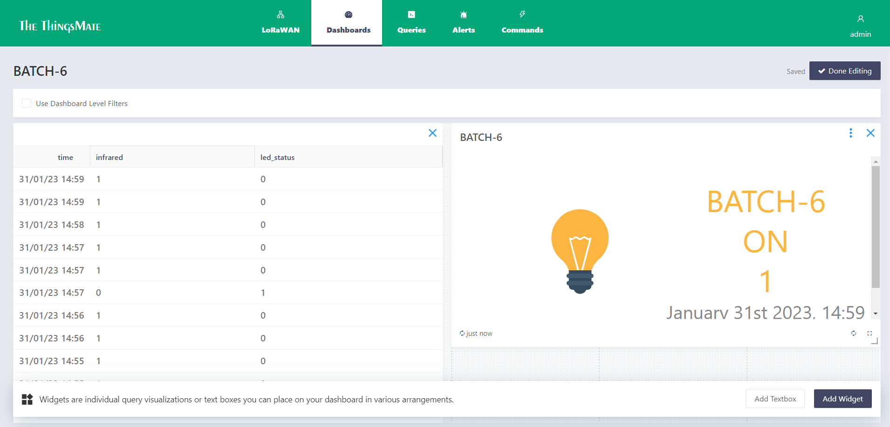
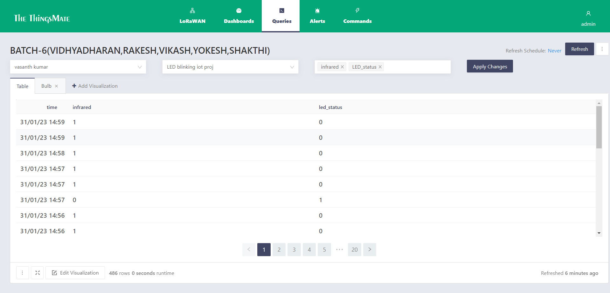

# EXPERIMENT--08-CONFIGURING-THE-APPLICATION-SERVER-FOR-DATA-VISUALIZATION-
 
## Aim: To  configure  the Application server and visualize the data on the dashboard 
## Components required: Iot application server 
## Theory :
 An application server is a modern form of platform middleware. It is system software that resides between the operating system (OS) on one side, the external resources (such as a database management system [DBMS], communications and Internet services) on another side and the users’ applications on the third side. The function of the application server is to act as host (or container) for the user’s business logic while facilitating access to and performance of the business application. The application server must perform despite the variable and competing traffic of client requests, hardware and software failures, the distributed nature of the larger-scale applications, and potential heterogeneity of data and processing resources required to fulfill the business requirements of the applications.

A high-end online-transaction-processing-style application server delivers business applications with guaranteed levels of performance, availability and integrity. An application server also supports multiple application design patterns, according to the nature of the business application and the practices in the particular industry for which the application has been designed. It typically supports multiple programming languages and deployment platforms, although most have a particular affinity to one or two of these. Some application servers that implement standard application interfaces and protocols, such as Java Enterprise Edition (Java EE), are entirely proprietary. At present, the proprietary application servers are typically built into OSs, packaged applications, such as portals and e-commerce solutions, or other products and are not offered as stand-alone products. Proprietary and Java EE-compliant application servers are estimated in our Market Share and Forecast reports.

As the application server market matures, high performance becomes a stronger criterion, and thus where vendors now incorporate extensions to application servers, such as extreme transaction processing and event-based processing capabilities, these are also included in this market segment.
## Procedure :

 1. login to the network server using login link  https://iot.saveetha.in/
 2.  click on the Application server as shown below 
 
 3.Click on the Add dashboard option as shown below 
 
 4.After creating dash board , using the edit option on the right corner  add the widgets as shown 
 

5. After addition of the widget on the data dash board the data should appear as shown belwo 
 
6. Create a query as shown below 
 
7. Using the visualization editor modify as per the requirements 
 
8. save to update the visualization on the dashboard as shown in the output 

## OUTPUT 
 

## Result: 

The Application  server and network server data is add on the data dashboard using visualiztion editor.
